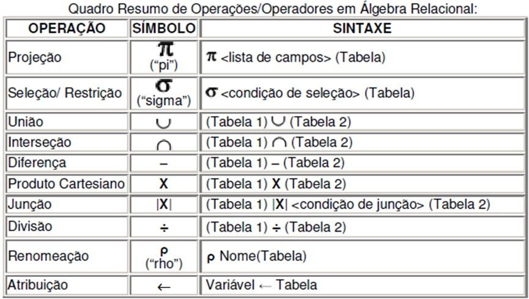
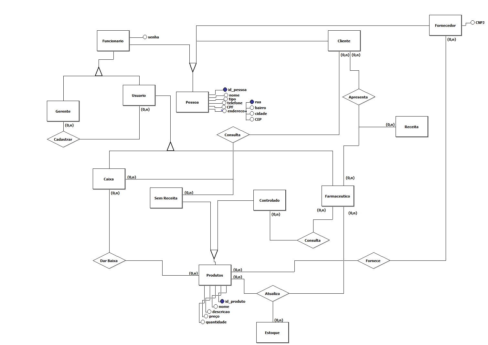

# Database I and Database II :high_brightness::high_brightness:

## :pushpin::pushpin: What will you find? :pushpin::pushpin:

This repository contains study notes and one project called "pharmacy inventory management system".

 

### Relational algebra

Relational algebra is one of the two formal query languages associated with the relational model. Queries in algebra are composed using a collection of operators. A
fundamental property is that every operator in the algebra accepts (one or two) relation instances as arguments and returns a relation instance as the result. This property makes it easy to compose operators to form a complex query—a relational algebra expression is recursively defined to be a relation, a unary algebra operator applied to a single expression, or a binary algebra operator applied to two expressions. We describe the basic operators of the algebra (selection, projection, union, cross-product, and difference), as well as some additional operators that can be defined in terms of the basic operators but arise frequently enough to warrant special attention, in the following sections

Each relational query describes a step-by-step procedure for computing the desired answer, based on the order in which operators are applied in the query. The procedural nature of the algebra allows us to think of an algebra expression as a recipe, or a plan, for evaluating a query, and relational systems in fact use algebra expressions to represent query evaluation plans

### Resolutions

#### Relational algebra

- [DB Enterprise](resolutions/resolucao-bd-empresa.pdf) - resolutions to the mini-world enterprise.
 

- [DB Sailors](resolutions/resolucao-bd-marinheiros.pdf) - resolutions from the example in the book  _Database Management Systems - Raghu Ramakrishnan_.

 

## Project DB 1:
- CRUD with Angular + NodeJS for a pharmacy inventory management system 
 

## Mini-world pharmacy project (PT-BR)
"Uma farmácia se trata de um estabelecimento onde os clientes podem comprar produtos, que
podem ser controlados ou sem receita. Cada produto possui um ID único, nome, descrição,
preço e quantidade em estoque. Os produtos controlados só podem ser vendidos com uma
receita, que é apresentada pelo cliente ao farmacêutico. Cada receita tem um ID único, data de
emissão e medicamentos prescritos.
A farmácia emprega várias pessoas, que podem ser funcionários ou clientes. Cada funcionário
tem um ID único, nome, cargo e data de admissão. Eles podem desempenhar diferentes
funções, como usuário do sistema ou gerente. O gerente tem a responsabilidade de cadastrar
novos usuários no sistema. Cada usuário pode ser um caixa ou um farmacêutico. O caixa é
responsável por registrar as transações de compra dos clientes e dar baixa nos produtos
quando são vendidos. Eles também mantêm o saldo do caixa, que é registrado com um ID
único. O farmacêutico atualiza as informações sobre os produtos e o estoque, que mantém
registros da quantidade disponível de cada produto com um ID único. Somente eles consultam
informações sobre produtos controlados.
Os produtos são fornecidos por fornecedores, que possuem um ID único, nome e data de
validade de contato. Eles fornecem produtos para a farmácia, que são então vendidos aos
clientes. Os clientes são identificados por um ID único, nome, CPF e telefone. Os clientes
podem realizar consultas no caixa, levando seus produtos ao caixa para que eles possam dar
baixa no sistema e também consultar os produtos sem receita que ficam a disposição do
cliente, livres para escolha. Os clientes também podem apresentar receitas ao farmacêutico
para adquirir produtos controlados."
 

## ER Model - pharmacy project

 

---

### References
- [1] Database Management Systems - Raghu Ramakrishnan [Here](books/dbms-raghu-ramakrishnan.pdf)

---
